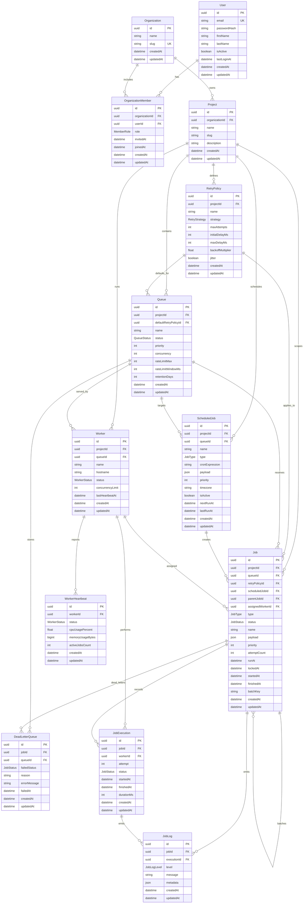

# Database ER Diagram

```mermaid
erDiagram
  User ||--o{ OrganizationMember : has
  Organization ||--o{ OrganizationMember : includes
  Organization ||--o{ Project : owns
  Project ||--o{ Queue : contains
  Project ||--o{ RetryPolicy : defines
  Project ||--o{ Job : scopes
  Project ||--o{ Worker : runs
  Project ||--o{ ScheduledJob : schedules
  RetryPolicy ||--o{ Queue : defaults_for
  RetryPolicy ||--o{ Job : applies_to
  Queue ||--o{ Job : receives
  Queue ||--o{ Worker : served_by
  Queue ||--o{ ScheduledJob : targets
  Queue ||--o{ DeadLetterQueue : stores
  ScheduledJob ||--o{ Job : creates
  Job ||--o{ Job : batches
  Worker ||--o{ Job : assigned
  Worker ||--o{ WorkerHeartbeat : reports
  Worker ||--o{ JobExecution : performs
  Job ||--o{ JobExecution : records
  Job ||--o{ JobLog : emits
  JobExecution ||--o{ JobLog : emits
  Job ||--o{ DeadLetterQueue : dead_letters

  User {
    uuid id PK
    string email UK
    string passwordHash
    string firstName
    string lastName
    boolean isActive
    datetime lastLoginAt
    datetime createdAt
    datetime updatedAt
  }

  Organization {
    uuid id PK
    string name
    string slug UK
    datetime createdAt
    datetime updatedAt
  }

  OrganizationMember {
    uuid id PK
    uuid organizationId FK
    uuid userId FK
    MemberRole role
    datetime invitedAt
    datetime joinedAt
    datetime createdAt
    datetime updatedAt
  }

  Project {
    uuid id PK
    uuid organizationId FK
    string name
    string slug
    string description
    datetime createdAt
    datetime updatedAt
  }

  Queue {
    uuid id PK
    uuid projectId FK
    uuid defaultRetryPolicyId FK
    string name
    QueueStatus status
    int priority
    int concurrency
    int rateLimitMax
    int rateLimitWindowMs
    int retentionDays
    datetime createdAt
    datetime updatedAt
  }

  RetryPolicy {
    uuid id PK
    uuid projectId FK
    string name
    RetryStrategy strategy
    int maxAttempts
    int initialDelayMs
    int maxDelayMs
    float backoffMultiplier
    boolean jitter
    datetime createdAt
    datetime updatedAt
  }

  Job {
    uuid id PK
    uuid projectId FK
    uuid queueId FK
    uuid retryPolicyId FK
    uuid scheduledJobId FK
    uuid parentJobId FK
    uuid assignedWorkerId FK
    JobType type
    JobStatus status
    string name
    json payload
    int priority
    int attemptCount
    datetime runAt
    datetime lockedAt
    datetime startedAt
    datetime finishedAt
    string batchKey
    datetime createdAt
    datetime updatedAt
  }

  JobExecution {
    uuid id PK
    uuid jobId FK
    uuid workerId FK
    int attempt
    JobStatus status
    datetime startedAt
    datetime finishedAt
    int durationMs
    datetime createdAt
    datetime updatedAt
  }

  JobLog {
    uuid id PK
    uuid jobId FK
    uuid executionId FK
    JobLogLevel level
    string message
    json metadata
    datetime createdAt
    datetime updatedAt
  }

  Worker {
    uuid id PK
    uuid projectId FK
    uuid queueId FK
    string name
    string hostname
    WorkerStatus status
    int concurrencyLimit
    datetime lastHeartbeatAt
    datetime createdAt
    datetime updatedAt
  }

  WorkerHeartbeat {
    uuid id PK
    uuid workerId FK
    WorkerStatus status
    float cpuUsagePercent
    bigint memoryUsageBytes
    int activeJobsCount
    datetime createdAt
    datetime updatedAt
  }

  DeadLetterQueue {
    uuid id PK
    uuid jobId FK
    uuid queueId FK
    JobStatus failedStatus
    string reason
    string errorMessage
    datetime failedAt
    datetime createdAt
    datetime updatedAt
  }

  ScheduledJob {
    uuid id PK
    uuid projectId FK
    uuid queueId FK
    string name
    JobType type
    string cronExpression
    json payload
    int priority
    string timezone
    boolean isActive
    datetime nextRunAt
    datetime lastRunAt
    datetime createdAt
    datetime updatedAt
  }
```
